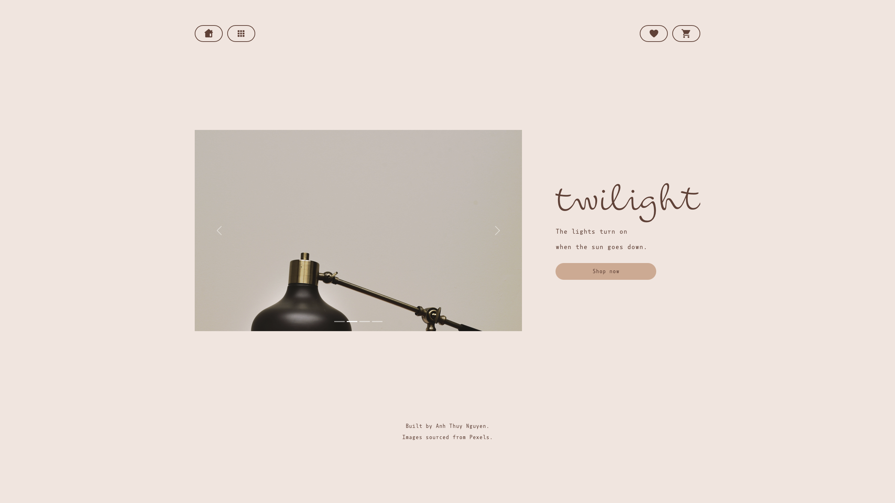
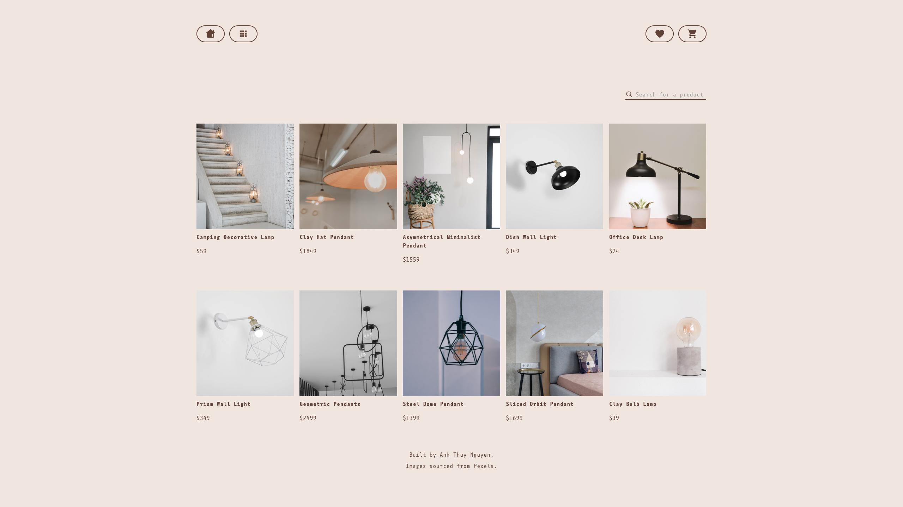
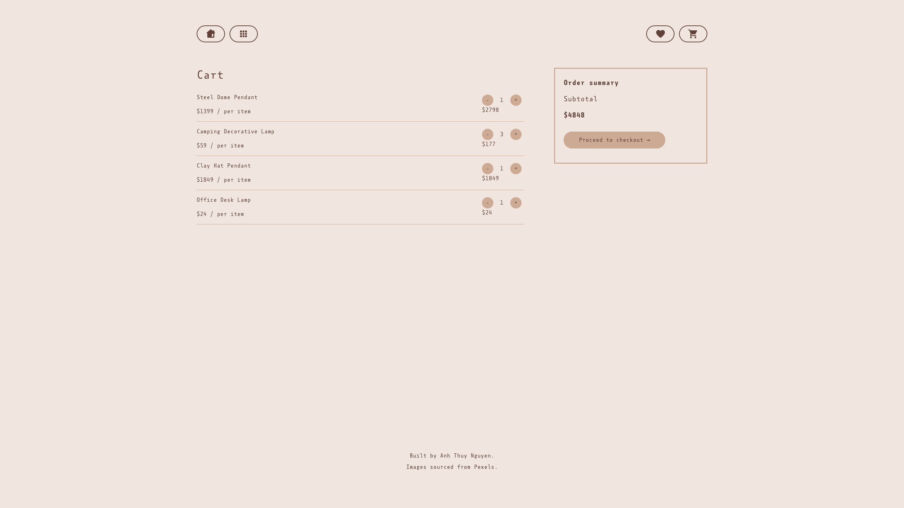
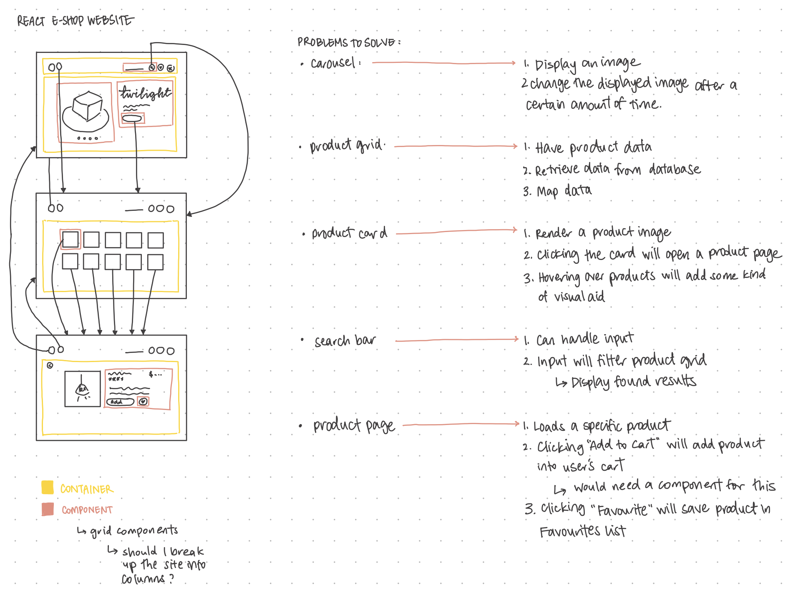
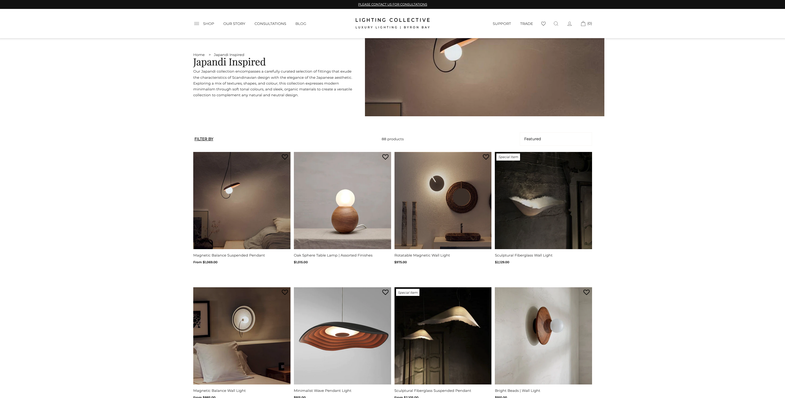

# "twilight" - eShop React Site

This is a project to build a mock eCommerce site using React.

<figure><figcaption>Screenshot of React site homepage</figcaption></figure>
<figure><figcaption>Screenshot of React site product grid</figcaption></figure>
<figure><figcaption>Screenshot of React site cart</figcaption></figure>

## Planning

Similarly to my previous \_nology projects, I started off this project with drafting out a basic visual for my site as well as write out a logic plan for the major parts of the site:

<figure></figure>

For the visual aesthetic of the eCommerce site, I opted to create separate pages for the homepage and the product grid because I thought it would create a more inviting and open experience for the user. This site design was inspired by the Japandi interior concept, so I used colours and decided on displaying light fixtures as products:

<figure><figcaption>Screenshot of Japandi light fixtures</figcaption></figure>

<figure><figcaption>Screenshot of Japandi light fixtures</figcaption></figure>

With my logic planning, I wanted to try a different approach where I wrote out tasks, instead of drafting code. I felt that because this project was being built with React, it was more appropriate to plan out the tasks this way. I also felt that this would be a good opportunity to practise abstraction and break down the different logic for each major component.

## Coding

I started my React application with file management, by creating different folders for containers and components to reflect my logic plan. As this particular project was my first proper implementation of a React application, I was quite challenged with which component to start and this particular issue hindered me from progressing my implementation. However, I decided that starting with the navigation bar would be the most logical choice as it would be seen across all the pages of my site.

From there, I mainly worked on creating other presentational components. I also tried to implement this site with mobile-first styling, and I found that React was quite ideal, since it was so modular.

When implementing logic and including a firestore database, I decided to write my own product data so that I could include images (sourced from Pexels) which were more appropriate to the visual goals of my application. Referring back to my logic plan was helpful in giving me clear goals for what each component was supposed to achieve.

## Things to improve on

-   Emulating a load-time, especially for interactive components (e.g., where the user is clicking on something)

## Known issues

-   Cart does not properly remove items from cart and database when quantity is zero.
-   Server javascript for cart uses static data.
